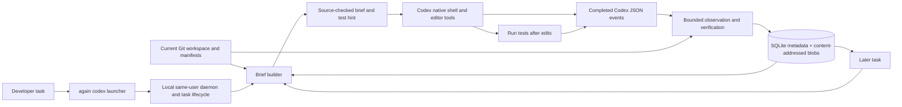

# Again

**A repository Brain for a coding agent.** Again gives Codex a short, source-checked starting brief, observes what the agent actually did, and carries useful work into the next task. The agent keeps its normal shell and editor tools. Again does not silently skip validation.

**Availability:** usable today as a local, source-installed beta on macOS and Linux. The native beta passed install and smoke checks on four platform targets, but no GitHub release or Homebrew package is published. Again is **not yet production-qualified** for a general speed or cost claim. See the [product update](docs/PRODUCT_UPDATE.md).

## Install and run

You need Git, Rust **1.88 or newer**, the [Codex CLI](https://developers.openai.com/codex/cli) installed and signed in, and access to this repository. The daemon-enabled build is required for `again codex`.

```bash
git clone --branch productize/beta-task-lifecycle --single-branch \
  https://github.com/alakhanpal23/again.git
cd again
cargo install --locked --path . --features daemon
again --version
```

From the repository you want to work on:

```bash
cd /path/to/your/project
again codex --workspace "$(pwd -P)" --task-id fix-issue-123 \
  --task "Fix issue 123 and run the relevant tests" -- --ephemeral
again brain show --workspace "$(pwd -P)"
```

Choose a new task ID for each task. The final `--` separates Again options from options passed to `codex exec`. Again uses your existing Codex login and local repository files; it needs no Again account or hosted service. The current beta lives on the linked development branch while its [pull request](https://github.com/alakhanpal23/again/pull/5) is open. Run `git pull` and reinstall to update it. [Release downloads](https://github.com/alakhanpal23/again/releases) are not available yet.

For an interactive Codex session, you can add the workspace-bound MCP entry, instruction skill, and observation hook:

```bash
again mcp setup --client codex --workspace "$(pwd -P)" \
  --apply --with-skill --with-brain-hook
again doctor
```

Review and trust the project hook in Codex `/hooks` before relying on interactive capture. The `again codex` launcher captures its own event stream and does not require that hook. The setup command changes local Codex configuration; run it separately for each repository you want bound to Again.

## What it helps with

| Situation | Again's current contribution |
| --- | --- |
| First task in a repository | Ranks likely files, shows up to two small verified previews, and suggests a project test command. |
| Follow-up task | Selects relevant prior investigation from Brain and checks source bytes again before showing a read or search result. |
| Multi-file search | Retains bounded, independently verified file and hit-line observations from supported completed `rg` commands. |
| Review of a completed run | `again brain show` displays bounded command, edit, test, run, and token summaries. Capture failures are reported by the launcher. |
| Repeated eligible command | Explicit `again run` can reuse exact output only when its request, executable, environment, and source proof remain valid. |

Brain hints can save investigation, but they do not prove that the agent avoided a call. Prior successful-test metadata is a hint; run tests for the new edit. `again brain clear --workspace "$(pwd -P)"` removes retained local Brain activity.

## How it works



The brief is a ranked suggestion backed by current repository bytes. For large files it labels excerpts as partial; the agent may need a wider read. The launcher streams Codex output, records completed events and token usage, and makes a successful Codex exit with incomplete Brain capture visible as an error. It does not intercept ordinary native shell calls, automatically replay them, or treat earlier test results as valid after a new edit.

The optional local MCP gateway and explicit `again run` path have stricter exact-reuse rules. Reuse requires a fresh dependency and execution-profile check; an unknown or changed input cannot authorize a hit. The broader Linux execution and team service designs in the [architecture document](docs/ARCHITECTURE.md) are separate development work, not part of the default Codex workflow.

| Component | Technology and role |
| --- | --- |
| CLI and local daemon | Rust 2024, `clap`, `tokio`; workspace-bound task lifecycle and MCP/JSON-RPC context. |
| Repository Brain | Bundled SQLite via `rusqlite`, content-addressed blobs, BLAKE3 source digests; bounded observations and run summaries. |
| Agent connection | Codex CLI JSON event stream for `again codex`; optional observation-only Codex `PostToolUse` hook for interactive sessions. |
| Validation | Project test suggestions require execution; source-bound Rust and Python harnesses test capture and paired agent outcomes. |

Read the [full architecture](docs/ARCHITECTURE.md) and [product contract](docs/PRODUCT.md) for authority boundaries and other experimental components.

## Measured results

The frozen live-agent evaluation used historical fixes in Packaging, Tomlkit, Camelcase, and Again. Each task ran cold and returning in both treatment orders; returning-task preparation time and tokens were charged. Independent repair oracles and agent-run tests determined acceptance.

| Frozen cohort | Accepted paired outcomes | Median Again / baseline time | Median API-equivalent cost | Result |
| --- | ---: | ---: | ---: | --- |
| [2 repositories, 8 pairs](bench/results/2026-09-24-real-repository-cohort-38c8bc7/summary.json) | 8/8 | 0.801 | 0.884 | Failed the frozen ≤0.800 time and cost gate |
| [4 repositories, 16 pairs](bench/results/2026-09-24-diverse-real-cohort-bb44f50/summary.json) | 14/16 | 0.849* | 0.903* | Failed acceptance and both speed/cost gates |

\*Accepted pairs only. The two excluded pairs had different failure modes: a baseline Camelcase repair failed validation; an Again Rust repair passed its test but lost its Brain run. The capture fault was fixed and replayed against the raw Rust event stream [after the frozen cohort](bench/results/2026-09-24-codex-run-capture-d8fc30a/capture.json). That repair does not change the cohort outcome. The [trace audit](bench/results/2026-09-24-diverse-real-cohort-bb44f50/audit.json) verifies all 48 raw event streams and token counts.

These samples show useful starting briefs and some faster individual tasks, with regressions elsewhere. They do **not** establish that Again makes completed coding work generally faster or cheaper. API-equivalent cost uses a frozen token rate card, not a billed Codex amount. A broader, quality-gated task cohort is still required. See the [product update](docs/PRODUCT_UPDATE.md) for the next gate.

To rerun the frozen diverse benchmark from a clean checkout with Codex available:

```bash
cargo build --locked --release --features daemon
python3 bench/diverse_real_cohort_v2.py \
  --binary target/release/again \
  --output-dir /tmp/again-diverse-real-cohort
```

For development checks:

```bash
cargo test --locked --features daemon
```

## Project status

The local single-agent loop is implemented and installable from source. Published packages, broad accepted-task performance evidence, cross-user recipient authentication, and production operations are open work. The [implementation status](docs/STATUS.md) separates tested code from planned work; the [product update](docs/PRODUCT_UPDATE.md) gives a short current readout. Apache-2.0 licensed.
