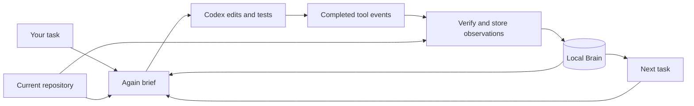

# Again

**Start with the right files. Remember the work. Pick up where you left off.**

Again prepares a short, source-checked brief before a Codex task, records the work Codex completes, and brings relevant findings into the next task. Your agent keeps using its normal shell, editor, and test tools.

```text
Your task → verified file previews + test hint → Codex edits and tests
                                                     ↓
Next task ← current findings from the local Brain ← completed tool events
```

## Get started

Install Rust 1.88 or newer and the [Codex CLI](https://developers.openai.com/codex/cli), then sign in to Codex. Build Again from the current development branch on macOS or Linux:

```bash
git clone --branch productize/beta-task-lifecycle --single-branch \
  https://github.com/alakhanpal23/again.git
cd again
cargo install --locked --path . --features daemon
```

Launch a task from any Git repository:

```bash
cd /path/to/your/project
again codex --workspace "$(pwd -P)" \
  --task-id fix-issue-123 \
  --task "Fix issue 123 and run the relevant tests" -- --ephemeral
```

Use a new task ID for each task. Arguments after `--` go to `codex exec`. Again uses your existing Codex sign-in and stores its Brain locally; it needs no Again account or hosted service.

After the run, inspect what Again retained:

```bash
again brain show --workspace "$(pwd -P)"
```

## What Again does

| Capability | What you get |
| --- | --- |
| Task brief | Likely files, up to two verified source previews, and a suggested project test command before Codex starts. |
| Repository Brain | Bounded records of completed reads, searches, edits, tests, run outcomes, and token usage. |
| Returning-task context | Relevant earlier findings, shown only after Again checks that their source bytes are still current. |
| Multi-file search memory | Verified file and hit-line observations from supported completed `rg` searches. |
| Exact command reuse | An optional `again run` path for eligible commands whose request, executable, environment, and source inputs still match. |

Again suggests tests but does not treat an earlier passing test as validation for a new edit. The normal `again codex` flow observes native tool events; it does not intercept or replace Codex's shell calls.

## How the Brain works



The launcher uses a local same-user daemon to bind the task to its workspace. It builds the brief from current source files and stored observations. Completed Codex JSON events are checked before bounded results are written to SQLite and content-addressed storage. BLAKE3 source digests let Again withhold old file observations when the repository changes. If a successful Codex run cannot be captured, the launcher reports the capture failure.

The CLI and daemon are written in Rust 2024 with `clap`, `tokio`, `rusqlite`, and BLAKE3. The optional MCP gateway supplies workspace-bound context and narrowly proven repository-tool reuse. See the [development architecture](https://github.com/alakhanpal23/again/blob/productize/beta-task-lifecycle/docs/ARCHITECTURE.md) for the complete authority model.

## Interactive Codex

To make Again available in an interactive Codex session, set up the workspace-bound MCP entry, instruction skill, and observation hook:

```bash
again mcp setup --client codex --workspace "$(pwd -P)" \
  --apply --with-skill --with-brain-hook
again doctor
```

Review and trust the project hook in Codex `/hooks` to enable interactive event capture. The `again codex` launcher captures its own event stream without this hook.

## More commands

```bash
again brain show --workspace "$(pwd -P)"   # inspect local run history
again brain clear --workspace "$(pwd -P)"  # clear that history
again doctor                               # check the local integration
```

To update a source install, pull the checkout and rerun `cargo install --locked --path . --features daemon`. To run the development tests, use `cargo test --locked --features daemon`.

The [roadmap](https://github.com/alakhanpal23/again/blob/productize/beta-task-lifecycle/docs/ROADMAP.md) covers planned work. [Status](https://github.com/alakhanpal23/again/blob/productize/beta-task-lifecycle/docs/STATUS.md) and [evidence](https://github.com/alakhanpal23/again/blob/productize/beta-task-lifecycle/docs/EVIDENCE.md) record implementation and benchmark details for the current development build.

Apache-2.0 licensed.
