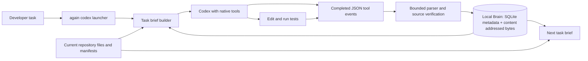

# Again

**A repository Brain for one coding agent.** Again starts a task with a short, source-checked brief and carries useful investigation into later tasks. It observes completed Codex tool events, records bounded local history, and rechecks source bytes before presenting an earlier read or search as current. The agent keeps using its normal editor and shell tools and runs tests after changing code.

Again is an experimental local developer tool. The key question is whether the brief and Brain reduce **time and API-equivalent cost per correct, validated task** across real repositories. See [Qualification](#qualification) for the measured boundary.

## When to use it

Use Again when you work repeatedly in the same repository with Codex: bug fixes, small features, and follow-up tasks that tend to revisit the same files or test commands. The clearest opportunity is a returning task whose prior source investigation is still current. Again can also help a cold task by pointing to likely files and a project test command before the first edit.

```bash
cargo install --locked --path . --features daemon
cd /path/to/your/repository
again codex --workspace "$(pwd -P)" --task-id fix-issue-123 \
  --task "Fix issue 123 and run the relevant tests" -- --ephemeral
again brain show --workspace "$(pwd -P)"
```

The `--` separates Again options from Codex options. Use a distinct task ID for each task. The launcher requires the Codex CLI and your existing Codex authentication. It does not require a hosted Again service.

## What the agent receives

1. **Current task brief.** Again identifies likely source files and provides up to two bounded, digest-checked previews. A small preview may be complete; a large file gets a labelled excerpt and may require a wider read.
2. **Repository Brain.** A previous completed read, search, edit, or test can become a compact hint. Before reusing source content in the next brief, Again checks the current file bytes. An agent-authored finding remains a suggestion, not a verified source fact.
3. **Validation guidance.** Again can suggest a relevant project test command. The suggestion does not certify the edit; run validation for the new change.
4. **Observed outcome.** The launcher records completed command, edit, and test events plus a compact run and token summary locally. `again brain show` lets you inspect that history.

The normal `again codex` path does not intercept native shell calls or silently skip tests. Exact output reuse is available separately through `again run` for eligible commands with a fresh proof; cheap ordinary reads often cost less to execute directly.

## System design



The local workspace daemon supplies task lifecycle and MCP context. The Brain stores bounded observations and recent run summaries. Source digests guard reuse of earlier file content; stale observations are withheld. Storage can help the agent avoid investigation, but it cannot prove that a test still passes after a new edit.

## Technology

| Layer | Implementation |
| --- | --- |
| CLI and local daemon | Rust 2024, minimum Rust 1.88; `clap`, `tokio`, JSON-RPC/MCP |
| Persistent state | Bundled SQLite via `rusqlite`, content addressed blobs, BLAKE3 digests |
| Agent integration | Codex CLI JSON event stream; optional repository-scoped `PostToolUse` hook for interactive sessions |
| Repository context | Bounded source previews, Git and manifest checks, source-checked Brain observations |
| Validation and benchmarks | Rust tests and Python 3 paired live-agent harnesses with independent edit oracles |

The optional MCP setup for interactive Codex is:

```bash
again mcp setup --client codex --workspace "$(pwd -P)" --apply --with-skill --with-brain-hook
```

Review and trust the project hook in Codex `/hooks` after installing it. The `again codex` launcher captures its own event stream without the hook. See [product contract](docs/PRODUCT.md) for command behavior and safety boundaries.

## Qualification

The [source-bound September 24 cohort](bench/results/2026-09-24-real-repository-cohort-38c8bc7/summary.json) used pinned historical bugs in [Packaging](https://github.com/pypa/packaging) and [Tomlkit](https://github.com/sdispater/tomlkit). All **8/8 paired tasks** were accepted: each agent repaired the bug, passed the independent oracle, and ran the specified test. The release binary and evaluation source both bind to `38c8bc7`.

| Task state | Pairs | Median Again / baseline time | Median API-equivalent cost |
| --- | ---: | ---: | ---: |
| Cold | 4 | 0.801 | 0.884 |
| Returning, including prior investigation | 4 | 0.858 | 0.840 |
| All pairs | 8 | **0.801** | **0.884** |

The frozen gate required both medians to be at most **0.800**, with every pair accepted. **Again did not qualify.** The total API-equivalent estimate across all eight tasks was $0.39245 for Again and $0.43145 for baseline, a 0.910 aggregate ratio. Returning packaging tasks showed little or no end-to-end time gain after charging for history creation; returning tomlkit tasks improved. With two repositories and two bug types, this is a bounded qualification exercise, not evidence of a product-wide effect or an actual billing reduction.

The real-repository cohort freezes two public upstream bug fixes, their parent commits, independent regression oracles, task prompts, and a pricing assumption. It runs cold and returning tasks in both baseline-first and Again-first order. For returning tasks, **both** conditions perform a real prior agent investigation, and its wall time and tokens count in the lifecycle total. A pair is accepted only when both agents complete the repair, pass the independent oracle, and run the prescribed test; the Again run must retain its Brain outcome. An accepted-only speed ratio cannot establish qualification if any planned pair fails.

Run the frozen evaluation from a clean checkout with a source-bound release binary:

```bash
cargo build --locked --release --features daemon
python3 bench/real_repository_cohort_v1.py \
  --binary target/release/again \
  --output-dir /tmp/again-real-repository-cohort
```

Reports include raw Codex JSONL, source and binary hashes, per-task outcomes, prior-task cost, and API-equivalent token estimates. That estimate uses a frozen rate card and is not a Codex bill. Historical one-repository repairs and synthetic tasks in [implementation status](docs/STATUS.md) remain useful diagnostics, but do not establish a product-wide speed or cost claim.

## Boundaries and project map

- Brain observations are local to the workspace. Previous reads are presented only while their source is current; command metadata can be incomplete for unrecognized shell forms.
- Again does not broadly cache the agent's native tools. Explicit command reuse and the MCP gateway have narrower proof and eligibility rules.
- Test suggestions require execution. Proof-based test skipping and broad cross-repository task acceleration remain open gates.

See [architecture](docs/ARCHITECTURE.md) for the full authority model, [status](docs/STATUS.md) for verified implementation, [evidence](docs/EVIDENCE.md) for retained results, and [product plan](docs/SINGLE_AGENT_PRODUCT_PLAN.md) for remaining work.

Apache-2.0 licensed.
