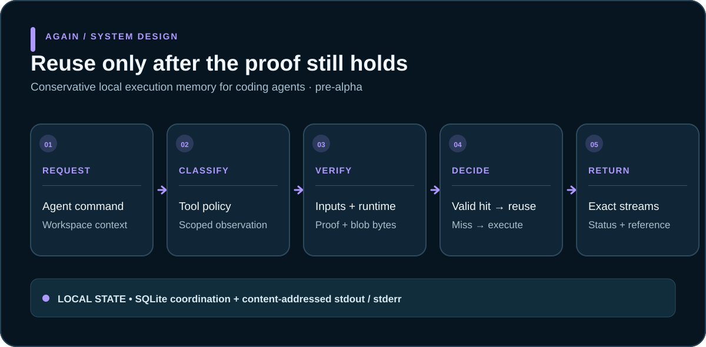

# Again

Again is a repository-aware execution memory and tool-call control plane for coding agents. It skips only work proven redundant, executes uncertain work, and returns the smallest useful verified observation.



*Pre-alpha architecture: a cache hit is returned only after current inputs, runtime, proof, and stored streams pass validation.*

## Current product

- `again run -- <argv...>` — run a command through the conservative local engine; cache hits return stored stdout, stderr, and status without rerunning the requested command.
- `again reference -- <argv...>` — verify an existing hit and emit compact content-addressed JSON; a miss never executes the command.
- `again mcp connect --workspace <path>` — start or join the authenticated per-workspace daemon and proxy MCP over stdio. The daemon drains active sessions and retires after ten idle minutes.
- `again mcp setup --client codex|claude --workspace <path>` — print an exact dry-run plan. Add `--apply`, `--inspect`, or `--remove`; changes use only the official client CLI and are verified afterward.
- `again mcp daemon status|stop --workspace <path>` — inspect or drain the local workspace daemon. New sessions fail with upgrade guidance when the executable or protocol differs.
- `again task list|inspect|export|delete|prune` — manage durable workspace tasks. Export creates a new private `0600` file; deletion requires `--yes`, and pruning requires an explicit `--dry-run` or `--apply`. Terminal history is retained until one of these explicit deletion operations succeeds.
- `again setup --codex` — install the instruction-only personal Codex skill.
- `again explain [id]` / `again show <id>` — inspect the latest decision or retrieve exact stored output.

## Product direction

Again gives coding agents persistent, verified repository understanding and execution memory so they can move from task to correct code with less rediscovery, fewer tool calls, and less repeated validation.

The target outcome is to help coding agents start with verified repository understanding, avoid repeating work, run only validation affected by a change, and share exact execution knowledge across agents.

## Technical Foundation

- **EffectIR schema** + **13 repository/Git tools** for exact bounded observations
- **SQLite coordination + CAS** for durable metadata, leases, events, immutable streams
- **Strict executable/profile checks** (macOS `strict-read-v0.5`: reviewed Apple tool BLAKE3 + `SystemVersion.plist`)
- **Scoped observation plans** that fingerprint only declared paths, trees, listings, identities, and Git state
- **v0 universal tool policy** separating exact reads, deterministic commands, freshness reads, mutations, credentials, communication, deployment, payment

## Status

**Pre-alpha.** Scoped validation is sampled and path-based; concurrent mutation after validation, transient global-resource changes, same-user/root pathname races, and unauthenticated same-user metadata-store writes remain outside the current boundary.

**Do not depend on Again for correctness-sensitive workloads** until documented gates are green. Unknown means Again refuses the call; the caller must rerun the original unchanged.

**Evidence checkpoint:** Source commit `bd24946e613af656d35c6af653a6cf25adc8359d` passed exact-SHA hosted CI on 2026-08-27. Gates 1–2 retained; Gates 3+ open until outside-user evidence exists.

**100K-case gate:** Passed with stock-Linux lane retaining required typed non-qualifying capability result.

## Quickstart

```bash
cargo install --locked --path . --features daemon
again setup --codex
again mcp setup --client codex --workspace "$(pwd -P)" --apply
again run -- cat path/to/file
```

## License

Apache-2.0.

## Roadmap

- [Agent acceleration](docs/AGENT_ACCELERATION.md) — complete user loop and product scorecard
- [Product contract](docs/PRODUCT.md) — shipping promise and current boundary
- [Straight-to-code](docs/STRAIGHT_TO_CODE.md) — edit-brief fast path and editable task evaluation
- [Reuse surface](docs/REUSE_SURFACE.md) — action-family and validation-profile inventory
- [Architecture](docs/ARCHITECTURE.md) — authority transitions and current/target component boundaries
- [Status](docs/STATUS.md) — what is implemented
- [Evidence](docs/EVIDENCE.md) — what has been measured
- [Development workstreams](docs/DEVELOPMENT_WORKSTREAMS.md) — terminal ownership and merge discipline
